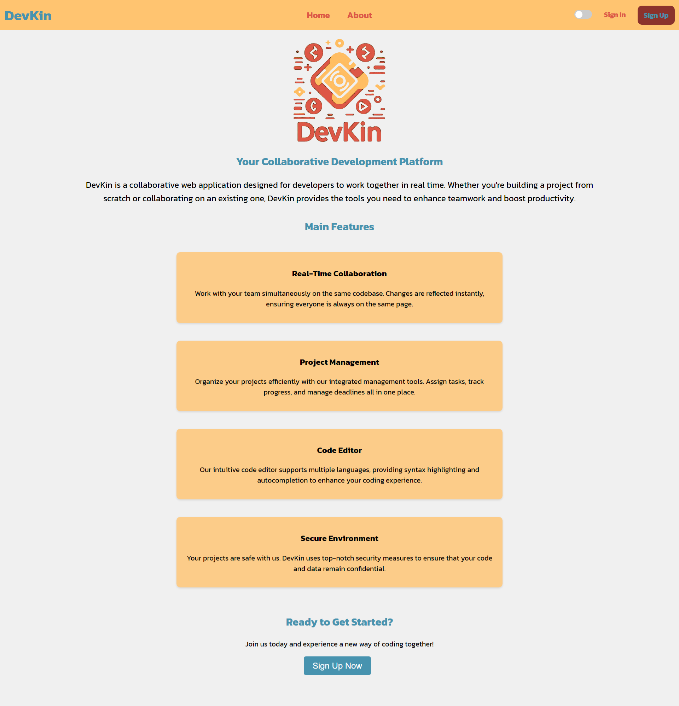
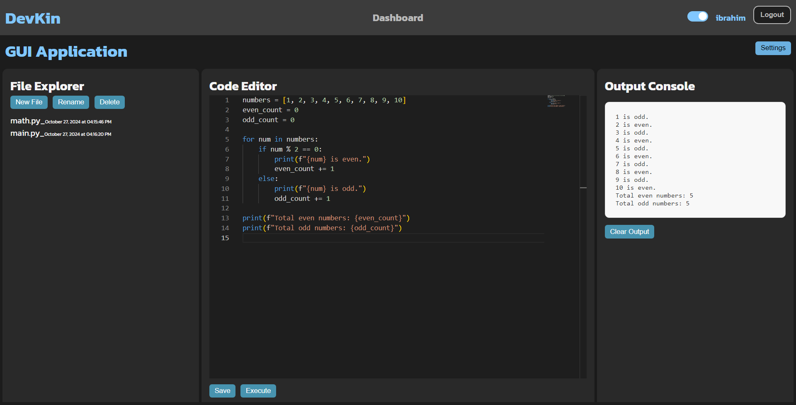

# DevKin - Collaborative Code Editor

DevKin is a collaborative code editor that enables developers to work together in real-time on shared projects. Users can create and manage projects, add collaborators, and execute code securely within a Dockerized environment. The application includes a sign-in/sign-up system, as well as light and dark mode options.

<p align="center">
  
  
</p>

## Features

- **Real-Time Collaboration**: 
  - Multiple developers can edit files simultaneously, with real-time updates powered by WebSockets.
  
- **Project and File Management**:
  - Users can create projects, invite collaborators, and track details like project name, size, and last modified date.
  - File storage is managed with MinIO, allowing easy deployment across various cloud providers.
  - Metadata for files and folders is stored in a MySQL database.

- **Code Execution**:
  - Run code securely in Docker containers. Users can write and execute code within the editor, with output displayed in real-time.

- **User Authentication**:
  - Secure sign-up and sign-in using JWT-based authentication.
  - Dashboard access is restricted to authenticated users only.

- **Themes**:
  - Customizable vintage theme with light and dark modes, accessible through the Navbar.

<p align="center">
  
  
</p>

## Tech Stack

- **Frontend**: React
  - Utilizes React Router, with protected routes for secure access.
  - Includes vintage theme styling with a light/dark mode toggle.

- **Backend**: Spring Boot
  - Custom security configuration with JWT for stateless sessions and CORS handling.
  - REST API handles authentication, project management, and file operations.

- **Database**: MySQL
  - Stores user and project data, including relationships between users and projects (e.g., Owner, Editor, Viewer).
  - **Future Work**: Consider Amazon RDS for reliable, managed database hosting.

- **Storage**: MinIO
  - Stores project files and folders, making them retrievable as needed.
  - Compatible with cloud deployments and optimized for local testing and containerized environments.

- **Containerization**: Docker
  - Used for isolated code execution and simplified deployments, managed with Docker Compose.

## Getting Started

1. **Clone the repository**:
   ```bash
   git clone https://github.com/Ibrahim0Ineizeh/DevKin
   cd DevKin

2. **Build the frontend**:
   ```bash
   cd devkin-frontend
   npm run build


3. **Backend Development**:
   - Start the backend server in your IDE or via the generated JAR file:
     ```bash
     java -jar devkin-backend/target/devkin-backend.jar
     ```
   - Ensure the backend server and frontend server are using consistent CORS configurations.

4. **Testing with Docker Compose**:
   - For end-to-end testing in a Docker environment, run:
     ```bash
     docker-compose up --build
     ```
